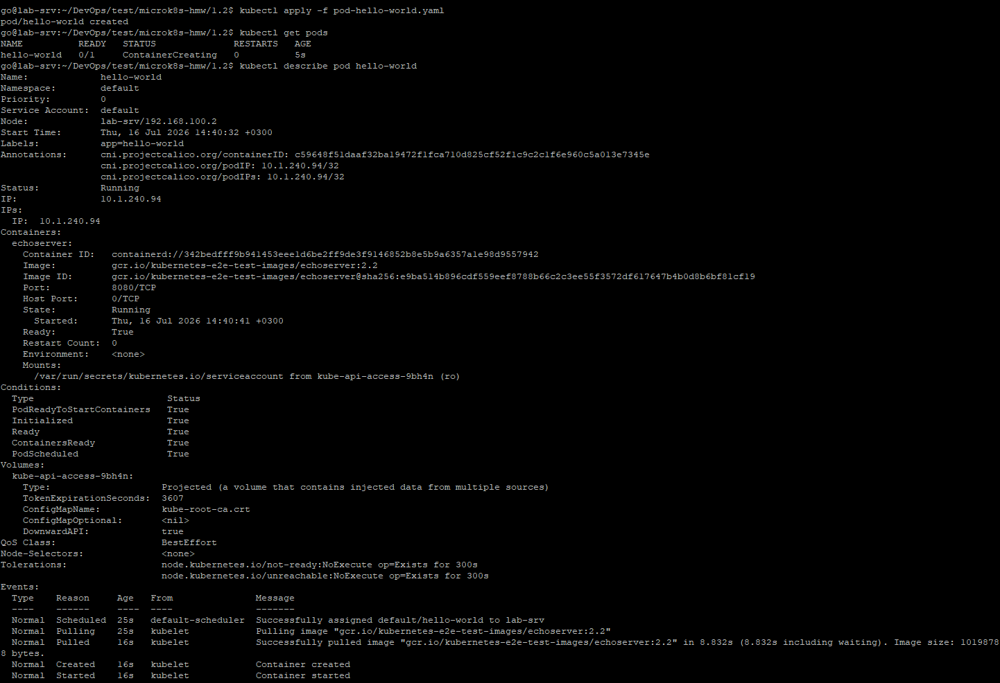
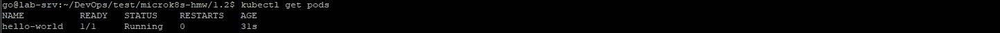
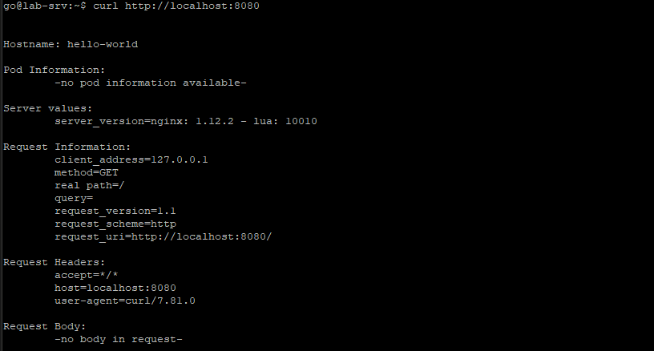
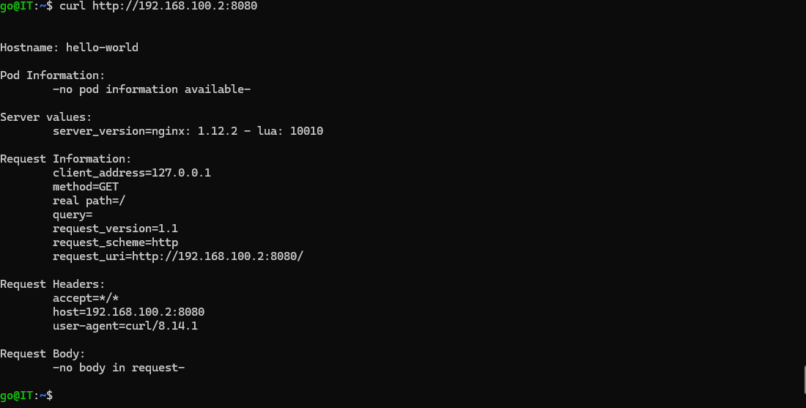
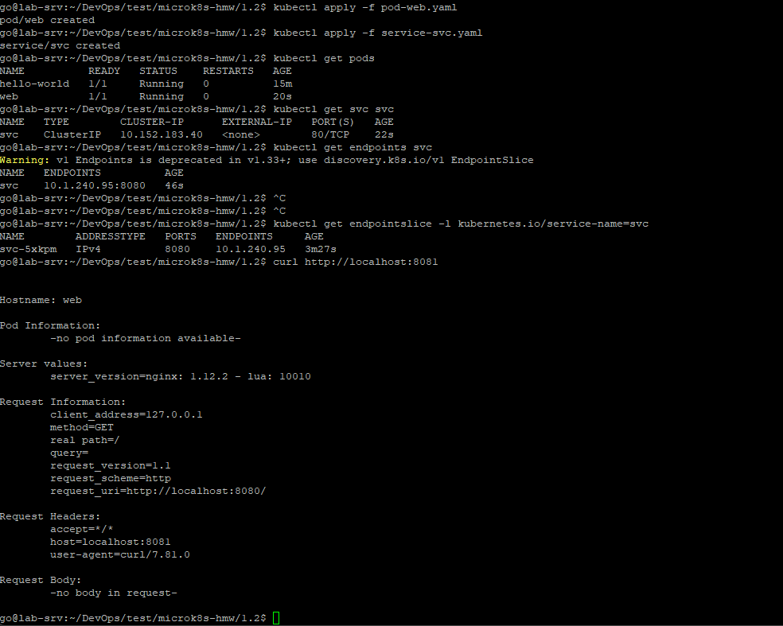

# Домашнее задание: Базовые объекты K8S (Pod, Service)

**Файлы манифестов:**

- [`pod-hello-world.yaml`](./pod-hello-world.yaml) — Задание 1
- [`pod-web.yaml`](./pod-web.yaml) — Задание 2 (Pod)
- [`service-svc.yaml`](./service-svc.yaml) — Задание 2 (Service)

---

Тестовая среда для работы с Kubernetes, установленна согласно предыдущему ДЗ.

---

## Задание 1. Pod `hello-world`

### 1.1. Применение манифеста

```bash
kubectl apply -f pod-hello-world.yaml
```

Проверка, что под запустился:

```bash
kubectl get pods
```

Если под завис в статусе `ContainerCreating` дольше пары минут — проверяем причину:

```bash
kubectl describe pod hello-world
```

(на MicroK8S типичная причина — pod тянет образ из `gcr.io`, и первое скачивание может занять время; посмотрите событие `Pulling`/`Pulled` в конце вывода `describe`)




### 1.2. Подключение через port-forward

```bash
kubectl port-forward pod/hello-world 8080:8080
```

В другом терминале (или в браузере `http://localhost:8080`):

```bash
curl http://localhost:8080
```

`echoserver` в ответ вернёт эхо HTTP-запроса — заголовки, метод, путь и т.д. Это подтверждает, что подключение до пода работает.




---

## Задание 2. Pod `web` + Service `svc`

### 2.1. Применение манифестов

```bash
kubectl apply -f pod-web.yaml
kubectl apply -f service-svc.yaml
```

Проверка состояние:

```bash
kubectl get pods
kubectl get svc svc
```

Проверка, что Service действительно "видит" под — в поле `Endpoints`
должен быть IP пода и порт `8080`:

```bash
kubectl get endpoints svc
```

Если `Endpoints` пустой (`<none>`) — значит `selector` в Service не
совпадает с `labels` пода. Сверьте оба манифеста построчно.

### 2.2. Подключение через port-forward к Service

```bash
kubectl port-forward service/svc 8081:80
```

(здесь `8081` — произвольный локальный порт, `80` — порт Service из манифеста)

В другом терминале (или в браузере `http://localhost:8081`):

```bash
curl http://localhost:8081
```



---
