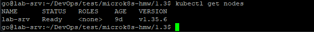
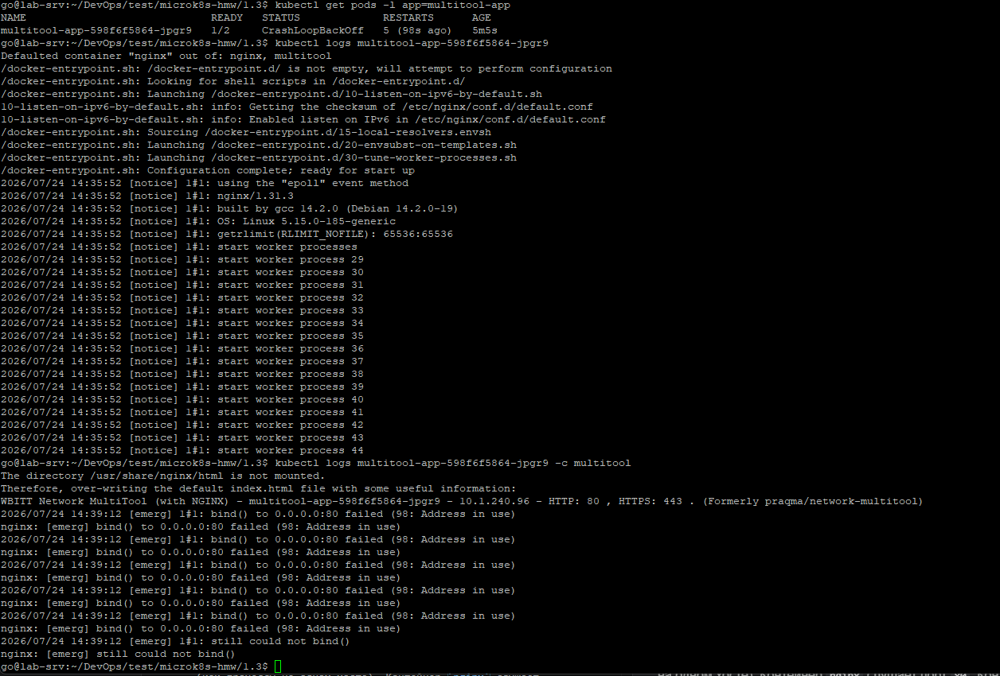
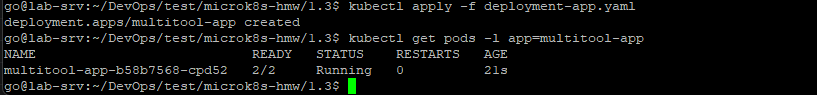
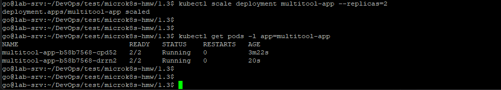
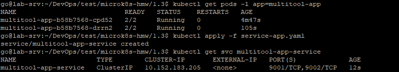
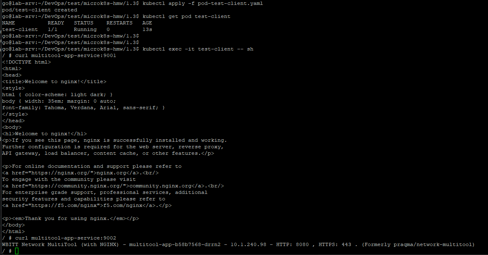
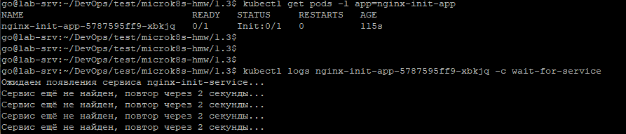
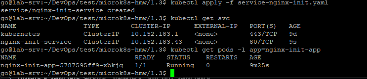
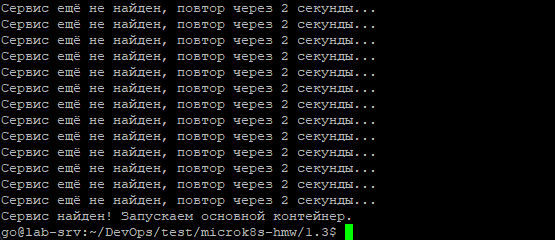

# Домашнее задание: Запуск приложений в Kubernetes

Репозиторий содержит решение двух заданий:
1. Deployment из двух контейнеров (nginx + multitool), диагностика и исправление ошибки, масштабирование, доступ через Service.
2. Deployment с Init-контейнером, который блокирует старт основного контейнера до появления Service.

---

## Предварительные требования

```bash
kubectl get nodes
```



---

## Задание 1. Deployment из двух контейнеров + доступ через Service

### Шаг 1. Развернуть Deployment и столкнуться с ошибкой

Сначала применяем заведомо нерабочую версию манифеста, чтобы продемонстрировать ошибку:
[`deployment-app-broken.yaml`](./deployment-app-broken.yaml)

```bash
kubectl apply -f deployment-app-broken.yaml
kubectl get pods -l app=multitool-app
```

Смотрим логи упавшего контейнера:
```bash
kubectl logs <pod-name> -c multitool
```


#### В чём причина ошибки

Все контейнеры одного Pod'а в Kubernetes используют **общее сетевое пространство имён** — общий IP, общий набор портов (как процессы на одном хосте). Контейнер `nginx` слушает порт `80`. Контейнер `multitool` (образ `wbitt/network-multitool`), если не задать переменную окружения `HTTP_PORT`, **по умолчанию тоже поднимает веб-сервер на порту 80**. Два процесса не могут одновременно занять один и тот же порт в общем сетевом пространстве — второй контейнер падает.

#### Исправление

Файл: [`deployment-app.yaml`](./deployment-app.yaml)

Контейнеру `multitool` явно задаётся `HTTP_PORT=8080` и `containerPort: 8080`, чтобы порты не пересекались с `nginx`.

```bash
kubectl delete -f deployment-app-broken.yaml
kubectl apply -f deployment-app.yaml
kubectl get pods -l app=multitool-app
```


### Шаг 2. Масштабировать Deployment до 2 реплик

**Масштабирование:**
```bash
kubectl scale deployment multitool-app --replicas=2
```
**После масштабирования:**
```bash
kubectl get pods -l app=multitool-app
```


### Шаг 3. Создать Service для доступа к репликам

Файл: [`service-app.yaml`](./service-app.yaml)

```bash
kubectl apply -f service-app.yaml
kubectl get svc multitool-app-service
```



### Шаг 4. Создать отдельный Pod и проверить доступ через curl

Файл: [`pod-test-client.yaml`](./pod-test-client.yaml)

```bash
kubectl apply -f pod-test-client.yaml
kubectl get pod test-client
```

Заходим в под и проверяем доступ до обоих контейнеров через Service:
```bash
kubectl exec -it test-client -- sh
curl multitool-app-service:9001    # проверяем nginx
curl multitool-app-service:9002    # проверяем multitool
```


---

## Задание 2. Deployment с Init-контейнером, ожидающим Service

### Шаг 1. Развернуть Deployment (без Service) и убедиться, что nginx не стартует

Файл: [`deployment-nginx-init.yaml`](./deployment-nginx-init.yaml)

```bash
kubectl apply -f deployment-nginx-init.yaml
kubectl get pods -l app=nginx-init-app
```
Под "зависает" в статусе `Init:0/1`  — основной контейнер nginx не запускается, потому что init-контейнер `wait-for-service` циклически пытается разрезолвить DNS-имя `nginx-init-service`, которого пока не существует.

Смотрим логи init-контейнера, чтобы убедиться, что он реально ждёт:
```bash
kubectl logs <pod-name> -c wait-for-service
```




### Шаг 2. Создать и запустить Service

Файл: [`service-nginx-init.yaml`](./service-nginx-init.yaml)

Имя сервиса (`nginx-init-service`) совпадает с тем, что ищет `nslookup` в init-контейнере.

```bash
kubectl apply -f service-nginx-init.yaml
kubectl get svc nginx-init-service
```

### Шаг 3. Убедиться, что init-контейнер завершился и nginx запустился

```bash
kubectl get pods -l app=nginx-init-app
```


Проверяем логи init-контейнера — должно быть сообщение об успешном завершении:
```bash
kubectl logs <pod-name> -c wait-for-service
```



---

## Манифесты

<details>
<summary><code>deployment-app-broken.yaml</code> (демонстрация ошибки)</summary>

```yaml
apiVersion: apps/v1
kind: Deployment
metadata:
  name: multitool-app
spec:
  replicas: 1
  selector:
    matchLabels:
      app: multitool-app
  template:
    metadata:
      labels:
        app: multitool-app
    spec:
      containers:
        - name: nginx
          image: nginx
          ports:
            - containerPort: 80

        - name: multitool
          image: wbitt/network-multitool
          ports:
            - containerPort: 80
          # HTTP_PORT не задан -> конфликт портов с nginx на 80
```
</details>

<details>
<summary><code>deployment-app.yaml</code> (финальная исправленная версия)</summary>

```yaml
apiVersion: apps/v1
kind: Deployment
metadata:
  name: multitool-app
spec:
  replicas: 1
  selector:
    matchLabels:
      app: multitool-app
  template:
    metadata:
      labels:
        app: multitool-app
    spec:
      containers:
        - name: nginx
          image: nginx
          ports:
            - containerPort: 80

        - name: multitool
          image: wbitt/network-multitool
          ports:
            - containerPort: 8080
          env:
            - name: HTTP_PORT
              value: "8080"
```
</details>

<details>
<summary><code>service-app.yaml</code></summary>

```yaml
apiVersion: v1
kind: Service
metadata:
  name: multitool-app-service
spec:
  type: ClusterIP
  selector:
    app: multitool-app
  ports:
    - name: nginx-port
      port: 9001
      targetPort: 80
    - name: multitool-port
      port: 9002
      targetPort: 8080
```
</details>

<details>
<summary><code>pod-test-client.yaml</code></summary>

```yaml
apiVersion: v1
kind: Pod
metadata:
  name: test-client
  labels:
    role: test-client
spec:
  containers:
    - name: multitool
      image: wbitt/network-multitool
```
</details>

<details>
<summary><code>deployment-nginx-init.yaml</code></summary>

```yaml
apiVersion: apps/v1
kind: Deployment
metadata:
  name: nginx-init-app
spec:
  replicas: 1
  selector:
    matchLabels:
      app: nginx-init-app
  template:
    metadata:
      labels:
        app: nginx-init-app
    spec:
      initContainers:
        - name: wait-for-service
          image: busybox
          command:
            - sh
            - -c
            - |
              echo "Ожидаем появления сервиса nginx-init-service...";
              # Проверяем УСПЕХ по содержимому вывода (grep), а не по exit code
              # nslookup — код возврата BusyBox nslookup ненадёжен из-за
              # параллельного запроса AAAA-записи (см. README, "Диагностика")
              until nslookup nginx-init-service 2>/dev/null | grep -qE 'Address: [0-9]+\.[0-9]+\.[0-9]+\.[0-9]+$'; do
                echo "Сервис ещё не найден, повтор через 2 секунды...";
                sleep 2;
              done;
              echo "Сервис найден! Запускаем основной контейнер.";

      containers:
        - name: nginx
          image: nginx
          ports:
            - containerPort: 80
```
</details>

<details>
<summary><code>service-nginx-init.yaml</code></summary>

```yaml
apiVersion: v1
kind: Service
metadata:
  name: nginx-init-service
spec:
  type: ClusterIP
  selector:
    app: nginx-init-app
  ports:
    - port: 80
      targetPort: 80
```
</details>

---

## Очистка ресурсов (по желанию)

```bash
kubectl delete -f service-nginx-init.yaml
kubectl delete -f deployment-nginx-init.yaml
kubectl delete -f pod-test-client.yaml
kubectl delete -f service-app.yaml
kubectl delete -f deployment-app.yaml
```
