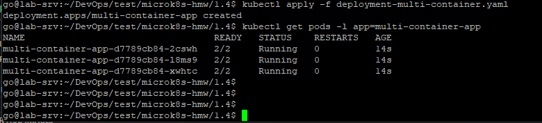
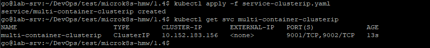
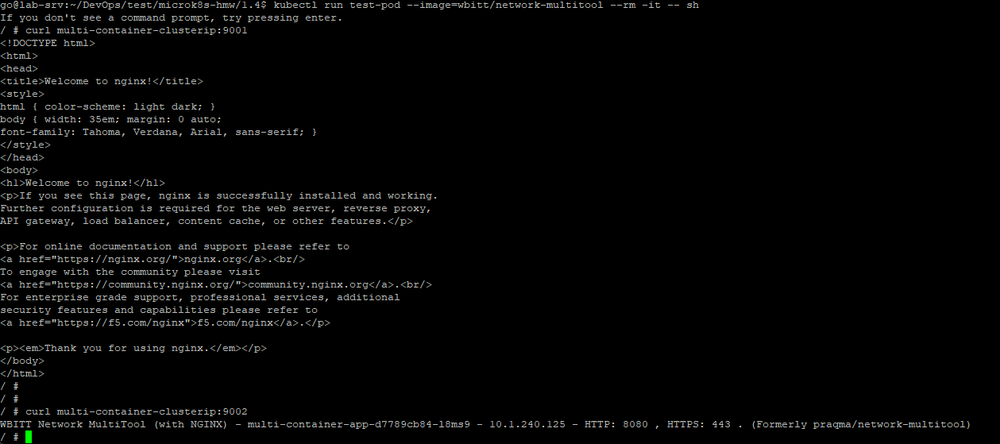
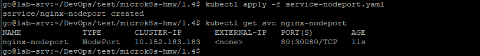
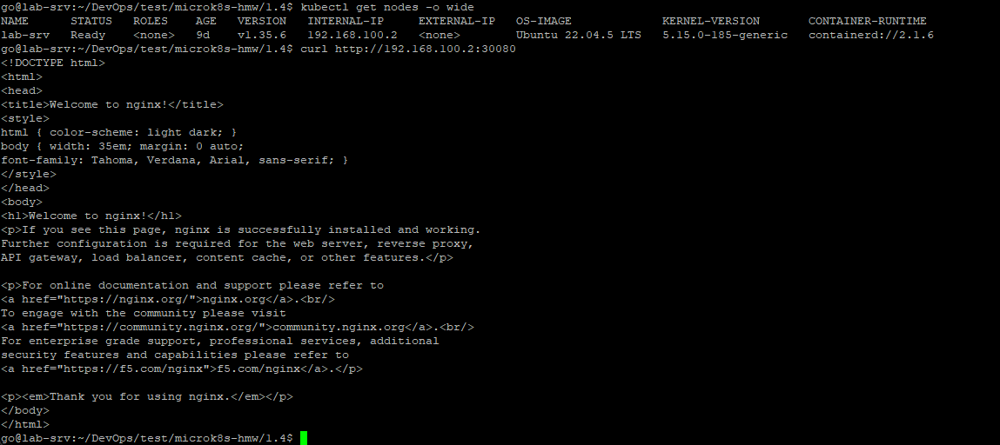
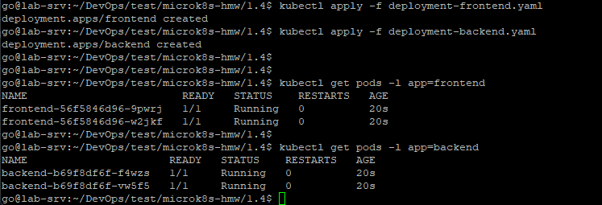
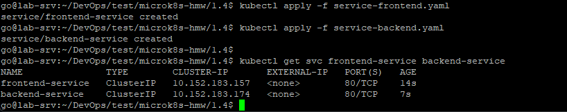
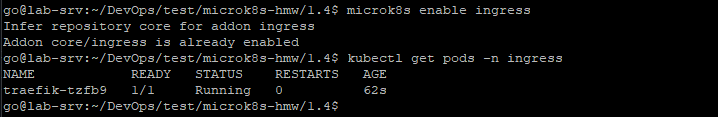
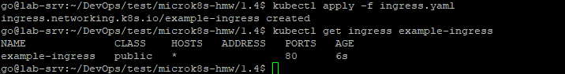
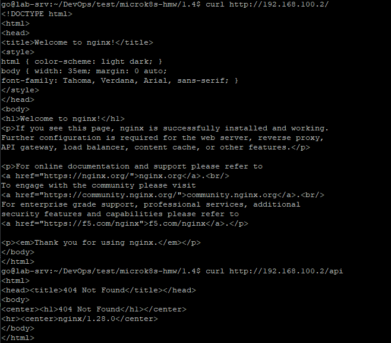

# Домашнее задание: Сетевое взаимодействие в Kubernetes

Репозиторий содержит решение двух заданий:
1. Доступ к приложению внутри кластера (ClusterIP) и снаружи (NodePort).
2. Доступ к двум приложениям через Ingress по разным путям.

---

## Предварительные требования

- Установлен Kubernetes (MicroK8S, Minikube или другой).
- Установлен `kubectl` и настроен доступ к кластеру.
- Ingress-контроллер будет включён отдельной командой в Задании 2.

Проверить, что кластер доступен:
```bash
kubectl get nodes
```

---

## Задание 1: Service (ClusterIP и NodePort)

### Шаг 1. Развернуть Deployment с двумя контейнерами

Файл: [`deployment-multi-container.yaml`](./deployment-multi-container.yaml)

```bash
kubectl apply -f deployment-multi-container.yaml
```

Проверить, что все 3 реплики поднялись и оба контейнера в поде запущены (READY 2/2):
```bash
kubectl get pods -l app=multi-container-app
```


### Шаг 2. Создать Service типа ClusterIP

Файл: [`service-clusterip.yaml`](./service-clusterip.yaml)

```bash
kubectl apply -f service-clusterip.yaml
kubectl get svc multi-container-clusterip
```


### Шаг 3. Проверить доступность изнутри кластера

Запускаем временный под с curl внутри кластера:
```bash
kubectl run test-pod --image=wbitt/network-multitool --rm -it -- sh
```

Внутри пода:
```bash
curl multi-container-clusterip:9001   # проверяем nginx
curl multi-container-clusterip:9002   # проверяем multitool
```


### Шаг 4. Создать Service типа NodePort

Файл: [`service-nodeport.yaml`](./service-nodeport.yaml)

```bash
kubectl apply -f service-nodeport.yaml
kubectl get svc nginx-nodeport
```


### Шаг 5. Проверить доступ снаружи кластера

Узнать IP ноды:
```bash
kubectl get nodes -o wide
```

Проверить доступ (порт `30080` указан в манифесте `nodePort`):
```bash
curl <node-ip>:30080
```
Либо открыть `http://<node-ip>:30080` в браузере.



---

## Задание 2: Ingress

### Шаг 1. Развернуть Deployment для frontend и backend

Файлы: [`deployment-frontend.yaml`](./deployment-frontend.yaml), [`deployment-backend.yaml`](./deployment-backend.yaml)

```bash
kubectl apply -f deployment-frontend.yaml
kubectl apply -f deployment-backend.yaml

kubectl get pods -l app=frontend
kubectl get pods -l app=backend
```



### Шаг 2. Создать Service для каждого приложения

Файлы: [`service-frontend.yaml`](./service-frontend.yaml), [`service-backend.yaml`](./service-backend.yaml)

```bash
kubectl apply -f service-frontend.yaml
kubectl apply -f service-backend.yaml

kubectl get svc frontend-service backend-service
```


### Шаг 3. Включить Ingress-контроллер

Для MicroK8S:
```bash
microk8s enable ingress
```
Для Minikube:
```bash
minikube addons enable ingress
```

Проверить, что под контроллера запущен:
```bash
kubectl get pods -n ingress
# или, в зависимости от дистрибутива:
kubectl get pods -n ingress-nginx
```


### Шаг 4. Создать Ingress

Файл: [`ingress.yaml`](./ingress.yaml)

```bash
kubectl apply -f ingress.yaml
kubectl get ingress example-ingress
```


> **Примечание.** Аннотация `rewrite-target: /` переписывает любой совпавший путь на `/` перед отправкой на backend-сервис. Для `multitool` это не критично — он отвечает одинаково на любой путь. Для реального REST API с маршрутизацией по пути `/api` потребовалась бы capture-группа (`path: /api(/|$)(.*)` + `rewrite-target: /$2`), чтобы backend видел путь `/api`, а не `/`.

### Шаг 5. Проверить доступность через Ingress

Для MicroK8S/Minikube `<host>` обычно — это IP ноды/кластера (Minikube: `minikube ip`).

```bash
curl <host>/
curl <host>/api
```
Либо открыть `http://<host>/` и `http://<host>/api` в браузере.



---

## Манифесты

<details>
<summary><code>deployment-multi-container.yaml</code></summary>

```yaml
# Deployment для Задания 1
# Разворачивает под с двумя контейнерами: nginx и multitool
# Реплики: 3 — для отказоустойчивости и проверки балансировки через Service
apiVersion: apps/v1
kind: Deployment
metadata:
  name: multi-container-app        # Имя Deployment
spec:
  replicas: 3                      # Количество копий пода
  selector:
    matchLabels:
      app: multi-container-app     # Селектор должен совпадать с labels пода ниже
  template:
    metadata:
      labels:
        app: multi-container-app   # Метка пода — по ней Service будет находить эти поды
    spec:
      containers:
        - name: nginx               # Первый контейнер — веб-сервер nginx
          image: nginx
          ports:
            - containerPort: 80     # Порт, который слушает nginx внутри контейнера

        - name: multitool            # Второй контейнер — сетевой отладочный инструмент
          image: wbitt/network-multitool
          ports:
            - containerPort: 8080   # Порт, который слушает multitool внутри контейнера
          env:
            - name: HTTP_PORT        # Переменная окружения обязательна для multitool
              value: "8080"          # Значение должно совпадать с containerPort выше
```
</details>

<details>
<summary><code>service-clusterip.yaml</code></summary>

```yaml
# Service типа ClusterIP для Задания 1
# Даёт доступ к nginx и multitool ТОЛЬКО внутри кластера
# (используется, например, из тестового пода через curl)
apiVersion: v1
kind: Service
metadata:
  name: multi-container-clusterip     # По этому имени сервис будет виден внутри кластера (DNS)
spec:
  type: ClusterIP                      # Тип по умолчанию — доступ только изнутри кластера
  selector:
    app: multi-container-app           # Выбирает поды с такой меткой (см. Deployment)
  ports:
    - name: nginx-port                 # Порт для доступа к nginx
      port: 9001                       # Порт самого Service (то, что указываем в curl)
      targetPort: 80                   # Порт контейнера nginx, куда идёт трафик
    - name: multitool-port             # Порт для доступа к multitool
      port: 9002                       # Порт самого Service
      targetPort: 8080                 # Порт контейнера multitool, куда идёт трафик
```
</details>

<details>
<summary><code>service-nodeport.yaml</code></summary>

```yaml
# Service типа NodePort для Задания 1
# Открывает доступ к nginx СНАРУЖИ кластера через порт узла (node)
apiVersion: v1
kind: Service
metadata:
  name: nginx-nodeport
spec:
  type: NodePort                 # Тип, который пробрасывает порт на все ноды кластера
  selector:
    app: multi-container-app     # Те же поды, что и в ClusterIP-сервисе (nginx внутри них)
  ports:
    - port: 80                   # Порт Service внутри кластера
      targetPort: 80             # Порт контейнера nginx
      nodePort: 30080             # Порт на самой ноде (диапазон 30000-32767)
                                   # Доступ снаружи: curl <node-ip>:30080
```
</details>

<details>
<summary><code>deployment-frontend.yaml</code></summary>

```yaml
# Deployment для Задания 2 — frontend-приложение
# Используется образ nginx как условная "фронтовая" часть
apiVersion: apps/v1
kind: Deployment
metadata:
  name: frontend
spec:
  replicas: 2                  # Две реплики для отказоустойчивости
  selector:
    matchLabels:
      app: frontend             # Селектор для связи Deployment <-> поды
  template:
    metadata:
      labels:
        app: frontend           # Метка, по которой Service найдёт эти поды
    spec:
      containers:
        - name: frontend
          image: nginx
          ports:
            - containerPort: 80  # nginx слушает 80 порт внутри контейнера
```
</details>

<details>
<summary><code>deployment-backend.yaml</code></summary>

```yaml
# Deployment для Задания 2 — backend-приложение
# Используется образ wbitt/network-multitool как условный "API" сервис
apiVersion: apps/v1
kind: Deployment
metadata:
  name: backend
spec:
  replicas: 2                     # Две реплики для отказоустойчивости
  selector:
    matchLabels:
      app: backend                 # Селектор для связи Deployment <-> поды
  template:
    metadata:
      labels:
        app: backend                # Метка, по которой Service найдёт эти поды
    spec:
      containers:
        - name: backend
          image: wbitt/network-multitool
          ports:
            - containerPort: 8080   # multitool слушает 8080 порт внутри контейнера
          env:
            - name: HTTP_PORT        # Обязательная переменная окружения для multitool
              value: "8080"          # Должна совпадать с containerPort
```
</details>

<details>
<summary><code>service-frontend.yaml</code></summary>

```yaml
# Service для frontend (Задание 2)
# Внутрикластерный ClusterIP-сервис, к которому будет обращаться Ingress
apiVersion: v1
kind: Service
metadata:
  name: frontend-service        # Имя сервиса — на него ссылается Ingress в поле backend.service.name
spec:
  type: ClusterIP                # Доступ только внутри кластера, наружу выходим через Ingress
  selector:
    app: frontend                # Выбирает поды frontend Deployment
  ports:
    - port: 80                   # Порт Service (на него ссылается Ingress: port.number)
      targetPort: 80             # Порт контейнера nginx
```
</details>

<details>
<summary><code>service-backend.yaml</code></summary>

```yaml
# Service для backend (Задание 2)
# Внутрикластерный ClusterIP-сервис, к которому будет обращаться Ingress по пути /api
apiVersion: v1
kind: Service
metadata:
  name: backend-service         # Имя сервиса — на него ссылается Ingress в поле backend.service.name
spec:
  type: ClusterIP                # Доступ только внутри кластера
  selector:
    app: backend                 # Выбирает поды backend Deployment
  ports:
    - port: 80                   # Порт Service (на него ссылается Ingress: port.number)
      targetPort: 8080           # Порт контейнера multitool (не 80!)
```
</details>

<details>
<summary><code>ingress.yaml</code></summary>

```yaml
# Ingress для Задания 2
# Маршрутизирует внешний трафик на два разных Service по пути URL:
#   /      -> frontend-service
#   /api   -> backend-service
#
# ВАЖНО: аннотация rewrite-target: "/" переписывает ЛЮБОЙ совпавший путь на "/"
# перед отправкой на backend-сервис. Это означает, что запрос на /api дойдёт
# до backend-service уже как "/", а не как "/api". Для multitool это не критично
# (он отвечает на любой путь одинаково), но для реального REST API с роутингом
# по пути потребовалась бы capture-группа, например:
#   path: /api(/|$)(.*)
#   rewrite-target: /$2
apiVersion: networking.k8s.io/v1
kind: Ingress
metadata:
  name: example-ingress
  annotations:
    nginx.ingress.kubernetes.io/rewrite-target: /   # Правило переписывания пути (см. примечание выше)
spec:
  rules:
    - http:
        paths:
          - path: /                     # Корневой путь -> frontend
            pathType: Prefix
            backend:
              service:
                name: frontend-service   # Имя Service из service-frontend.yaml
                port:
                  number: 80

          - path: /api                  # Путь /api -> backend
            pathType: Prefix
            backend:
              service:
                name: backend-service    # Имя Service из service-backend.yaml
                port:
                  number: 80
```
</details>

---

## Очистка ресурсов

```bash
kubectl delete -f ingress.yaml
kubectl delete -f service-backend.yaml
kubectl delete -f service-frontend.yaml
kubectl delete -f deployment-backend.yaml
kubectl delete -f deployment-frontend.yaml
kubectl delete -f service-nodeport.yaml
kubectl delete -f service-clusterip.yaml
kubectl delete -f deployment-multi-container.yaml
```
