# Домашнее задание: Хранение в Kubernetes

Репозиторий содержит решение трёх заданий:
1. Обмен данными между контейнерами через `emptyDir`.
2. Использование `PersistentVolume` + `PersistentVolumeClaim` с ручным связыванием (`hostPath`).
3. Использование `StorageClass` для декларативного связывания `PVC` и `PV`.

---

## Предварительные требования

```bash
kubectl get nodes
```

Для заданий 2 и 3 понадобится создать директории на самой ноде кластера:

```bash
sudo mkdir -p /mnt/data/k8s-homework/pv-manual
sudo mkdir -p /mnt/data/k8s-homework/pv-sc
sudo chmod 777 /mnt/data/k8s-homework/pv-manual /mnt/data/k8s-homework/pv-sc
```
> Права `777` — упрощение для учебного стенда, чтобы не разбираться с UID/GID контейнеров busybox/multitool.

---

## Задание 1. Обмен данными между контейнерами (emptyDir)

Файл: [`containers-data-exchange.yaml`](./containers-data-exchange.yaml)

Контейнер `writer` (busybox) каждые 5 секунд дописывает текущую дату в файл `/data/shared.log` на общем томе `emptyDir`. Контейнер `reader` (multitool) непрерывно читает этот файл через `tail -f`.

### Шаг 1. Развернуть Deployment

```bash
kubectl apply -f containers-data-exchange.yaml
kubectl get pods -l app=data-exchange
```

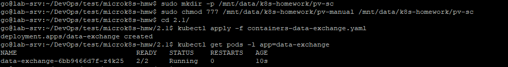

### Шаг 2. Описание пода

```bash
kubectl describe pod -l app=data-exchange
```

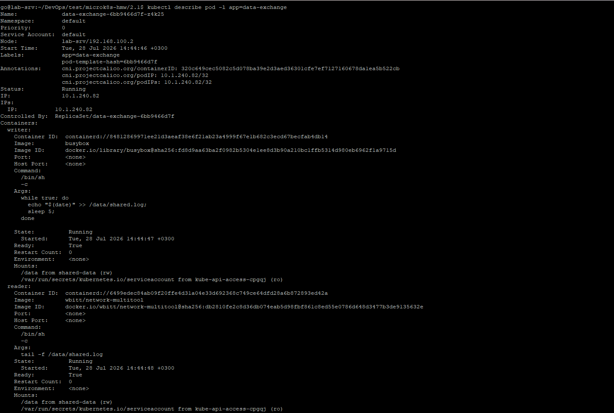
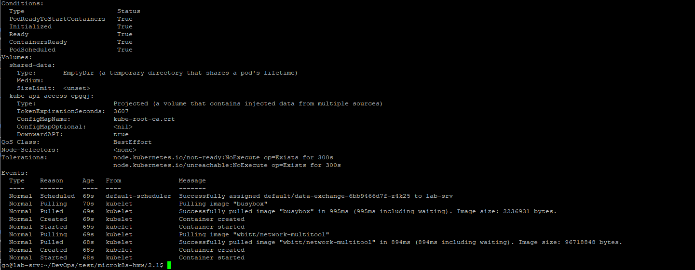

### Шаг 3. Проверить чтение файла контейнером reader

```bash
kubectl logs -l app=data-exchange -c reader -f
```

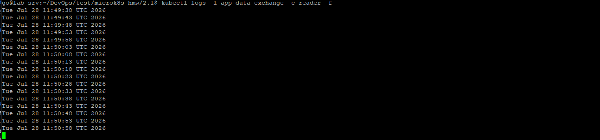

Либо явно зайти в контейнер и выполнить `tail -f` вручную:
```bash
kubectl exec -it <имя-пода> -c reader -- tail -f /data/shared.log
```

---

## Задание 2. PersistentVolume + PersistentVolumeClaim

Файл: [`pv-pvc.yaml`](./pv-pvc.yaml)

`PersistentVolume` создаётся вручную и указывает на директорию `/mnt/data/k8s-homework/pv-manual` на ноде. `PersistentVolumeClaim` статически привязывается к этому PV через `volumeName`. Deployment использует PVC вместо `emptyDir` — данные переживут удаление пода.

### Шаг 1. Создать PV, PVC и Deployment

```bash
kubectl apply -f pv-pvc.yaml
```

### Шаг 2. Проверить состояние ресурсов

```bash
kubectl get pv manual-pv
kubectl get pvc manual-pvc
kubectl get pods -l app=data-exchange-pvc
```

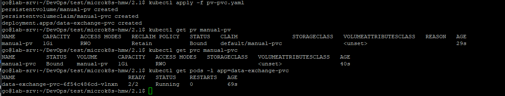

### Шаг 3. Продемонстрировать чтение данных контейнером multitool

```bash
kubectl logs -l app=data-exchange-pvc -c reader -f
```
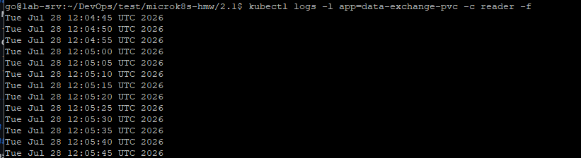

Дополнительно можно убедиться, что файл реально лежит на ноде:
```bash
cat /mnt/data/k8s-homework/pv-manual/shared.log
```
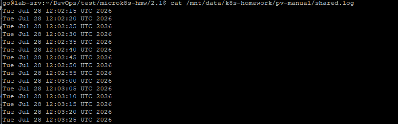

### Шаг 4. Удалить Deployment и PVC. Что стало с PV?

```bash
kubectl delete deployment data-exchange-pvc
kubectl delete pvc manual-pvc

kubectl describe pv manual-pv
```

**Объяснение:**
PV **не удаляется** и переходит в статус `Released` (не `Available` и не `Bound`). Это результат политики `persistentVolumeReclaimPolicy: Retain`, заданной в манифесте: при удалении PVC, к которому был привязан PV, Kubernetes **не трогает** ни сам объект PV, ни данные на диске — он лишь помечает PV как "освобождённый от claim'а", ожидая, что администратор кластера вручную решит, что делать с данными (переиспользовать, очистить, удалить PV). Это защита от случайной потери данных: с `Retain` Kubernetes никогда не удаляет содержимое самостоятельно.

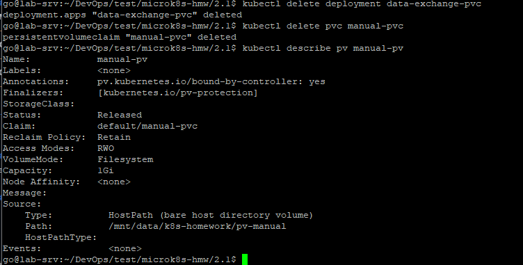


### Шаг 5. Файл на диске ноды и удаление PV

Проверяем, что файл всё ещё физически существует на ноде (несмотря на удаление Deployment и PVC):
```bash
cat /mnt/data/k8s-homework/pv-manual/shared.log
```
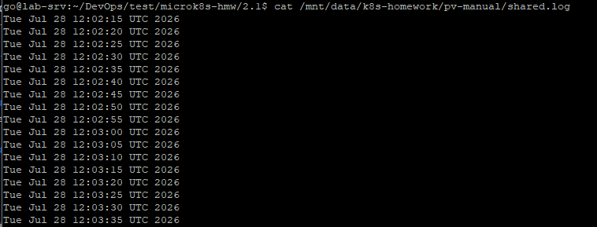

Удаляем сам PV:
```bash
kubectl delete pv manual-pv
```

Проверяем файл ещё раз:
```bash
cat /mnt/data/k8s-homework/pv-manual/shared.log
ls -la /mnt/data/k8s-homework/pv-manual/
```

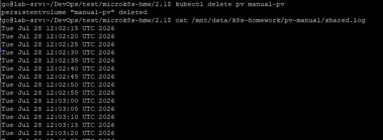
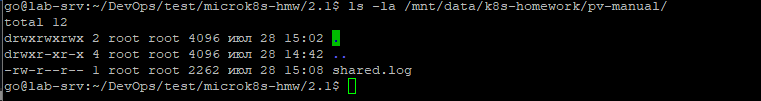


**Объяснение:**
Файл **остаётся на диске** и после удаления объекта `PersistentVolume`. Объект `PV` в Kubernetes — это лишь **метаданные/абстракция**, описывающая том хранилища (в случае `hostPath` — просто путь на файловой системе ноды). Удаление PV удаляет только этот объект из API Kubernetes, но не трогает реальные данные на диске: с `hostPath` Kubernetes никогда не управляет содержимым директории напрямую, это ответственность администратора ноды. Чтобы физически удалить файл, нужно сделать это вручную:

```bash
sudo rm /mnt/data/k8s-homework/pv-manual/shared.log
```

---

## Задание 3. StorageClass

Файл: [`sc.yaml`](./sc.yaml)

`StorageClass` с `provisioner: kubernetes.io/no-provisioner` не создаёт диск автоматически — реальное хранилище всё равно готовится вручную через `PersistentVolume` с соответствующим `storageClassName` (аналогично Заданию 2, но связывание PVC↔PV теперь идёт по имени класса, а не жёстко по имени конкретного PV). `volumeBindingMode: WaitForFirstConsumer` откладывает связывание PVC с PV до момента, когда под реально планируется на ноду — это важно для локальных хранилищ, привязанных к конкретному хосту.

### Шаг 1. Создать StorageClass, PV и PVC

```bash
kubectl apply -f sc.yaml
```

### Шаг 2. Проверить состояние ресурсов

```bash
kubectl get sc local-manual-sc
kubectl get pv sc-backed-pv
kubectl get pvc sc-pvc
```

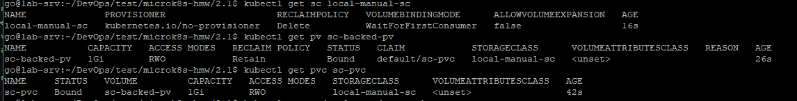


### Шаг 3. Проверить под и чтение данных

```bash
kubectl get pods -l app=data-exchange-sc
kubectl logs -l app=data-exchange-sc -c reader -f
```

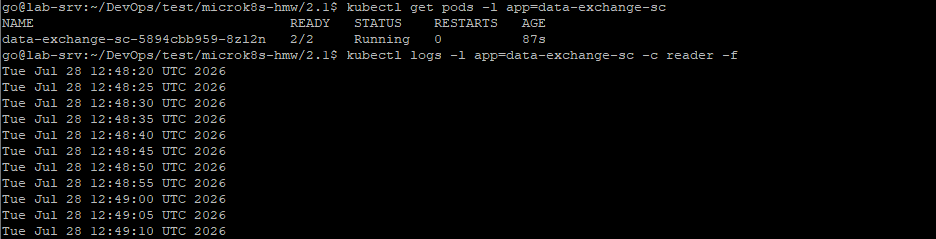

Проверка файла на ноде:
```bash
cat /mnt/data/k8s-homework/pv-sc/shared.log
```

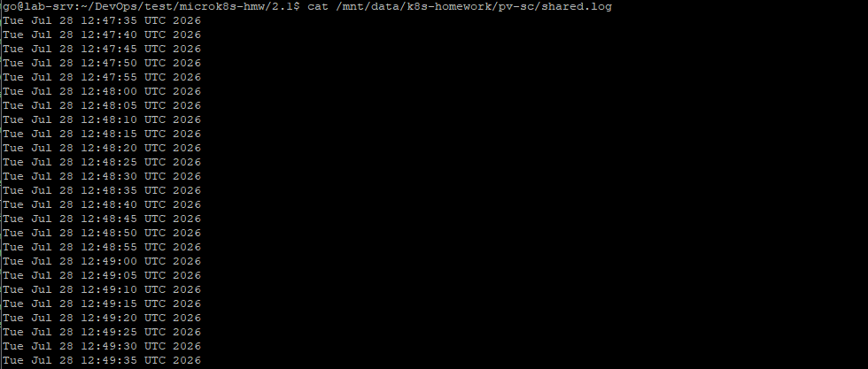

---

## Манифесты

<details>
<summary><code>containers-data-exchange.yaml</code></summary>

```yaml
apiVersion: apps/v1
kind: Deployment
metadata:
  name: data-exchange
spec:
  replicas: 1
  selector:
    matchLabels:
      app: data-exchange
  template:
    metadata:
      labels:
        app: data-exchange
    spec:
      containers:
        - name: writer
          image: busybox
          command: ["/bin/sh", "-c"]
          args:
            - |
              while true; do
                echo "$(date)" >> /data/shared.log;
                sleep 5;
              done
          volumeMounts:
            - name: shared-data
              mountPath: /data

        - name: reader
          image: wbitt/network-multitool
          command: ["/bin/sh", "-c"]
          args:
            - "tail -f /data/shared.log"
          volumeMounts:
            - name: shared-data
              mountPath: /data

      volumes:
        - name: shared-data
          emptyDir: {}
```
</details>

<details>
<summary><code>pv-pvc.yaml</code></summary>

```yaml
apiVersion: v1
kind: PersistentVolume
metadata:
  name: manual-pv
spec:
  capacity:
    storage: 1Gi
  volumeMode: Filesystem
  accessModes:
    - ReadWriteOnce
  persistentVolumeReclaimPolicy: Retain
  hostPath:
    path: /mnt/data/k8s-homework/pv-manual

---
apiVersion: v1
kind: PersistentVolumeClaim
metadata:
  name: manual-pvc
spec:
  volumeName: manual-pv
  volumeMode: Filesystem
  accessModes:
    - ReadWriteOnce
  resources:
    requests:
      storage: 1Gi

---
apiVersion: apps/v1
kind: Deployment
metadata:
  name: data-exchange-pvc
spec:
  replicas: 1
  selector:
    matchLabels:
      app: data-exchange-pvc
  template:
    metadata:
      labels:
        app: data-exchange-pvc
    spec:
      containers:
        - name: writer
          image: busybox
          command: ["/bin/sh", "-c"]
          args:
            - |
              while true; do
                echo "$(date)" >> /data/shared.log;
                sleep 5;
              done
          volumeMounts:
            - name: shared-data
              mountPath: /data

        - name: reader
          image: wbitt/network-multitool
          command: ["/bin/sh", "-c"]
          args:
            - "tail -f /data/shared.log"
          volumeMounts:
            - name: shared-data
              mountPath: /data

      volumes:
        - name: shared-data
          persistentVolumeClaim:
            claimName: manual-pvc
```
</details>

<details>
<summary><code>sc.yaml</code></summary>

```yaml
apiVersion: storage.k8s.io/v1
kind: StorageClass
metadata:
  name: local-manual-sc
provisioner: kubernetes.io/no-provisioner
volumeBindingMode: WaitForFirstConsumer

---
apiVersion: v1
kind: PersistentVolume
metadata:
  name: sc-backed-pv
spec:
  capacity:
    storage: 1Gi
  volumeMode: Filesystem
  accessModes:
    - ReadWriteOnce
  persistentVolumeReclaimPolicy: Retain
  storageClassName: local-manual-sc
  hostPath:
    path: /mnt/data/k8s-homework/pv-sc

---
apiVersion: v1
kind: PersistentVolumeClaim
metadata:
  name: sc-pvc
spec:
  volumeMode: Filesystem
  accessModes:
    - ReadWriteOnce
  resources:
    requests:
      storage: 1Gi
  storageClassName: local-manual-sc

---
apiVersion: apps/v1
kind: Deployment
metadata:
  name: data-exchange-sc
spec:
  replicas: 1
  selector:
    matchLabels:
      app: data-exchange-sc
  template:
    metadata:
      labels:
        app: data-exchange-sc
    spec:
      containers:
        - name: writer
          image: busybox
          command: ["/bin/sh", "-c"]
          args:
            - |
              while true; do
                echo "$(date)" >> /data/shared.log;
                sleep 5;
              done
          volumeMounts:
            - name: shared-data
              mountPath: /data

        - name: reader
          image: wbitt/network-multitool
          command: ["/bin/sh", "-c"]
          args:
            - "tail -f /data/shared.log"
          volumeMounts:
            - name: shared-data
              mountPath: /data

      volumes:
        - name: shared-data
          persistentVolumeClaim:
            claimName: sc-pvc
```
</details>

---

## Очистка ресурсов

```bash
kubectl delete -f sc.yaml
kubectl delete -f containers-data-exchange.yaml
# pv-pvc.yaml ресурсы уже удалены вручную по ходу Задания 2 (см. Шаги 4-5)

sudo rm -rf /mnt/data/k8s-homework
```
