# Домашнее задание: Настройка приложений и управление доступом в Kubernetes

Репозиторий содержит решение трёх заданий:
1. Конфигурация веб-страницы через ConfigMap.
2. HTTPS через Secret и Ingress с TLS-терминацией.
3. Ограничение доступа пользователя через RBAC.

---

## Предварительные требования

```bash
kubectl get nodes
openssl version
```

---

## Задание 1. ConfigMap

Файлы: [`deployment.yaml`](./deployment.yaml), [`configmap-web.yaml`](./configmap-web.yaml)

### О найденной и исправленной ошибке

В шаблоне задания ConfigMap с `index.html` монтируется в `/etc/nginx/conf.d` — это директория для `.conf`-файлов (описывающих server-блоки), а не для статического HTML. nginx по умолчанию подключает из `conf.d` только файлы `*.conf` (см. `include /etc/nginx/conf.d/*.conf;` в `/etc/nginx/nginx.conf`), поэтому `index.html` там не заработает как страница — нужен документ-рут: `/usr/share/nginx/html`. В `deployment.yaml` путь исправлен.

Также, по опыту предыдущих ДЗ, контейнеру `multitool` явно задан `HTTP_PORT=8080`, чтобы избежать конфликта портов с `nginx` (оба по умолчанию используют порт 80 в общем сетевом пространстве Pod'а).

### Шаг 1. Применить ConfigMap и Deployment

```bash
kubectl apply -f configmap-web.yaml
kubectl apply -f deployment.yaml
kubectl get pods -l app=web-app
```
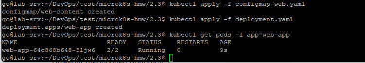

### Шаг 2. Проверить, что ConfigMap подключился

```bash
kubectl describe pod -l app=web-app
```
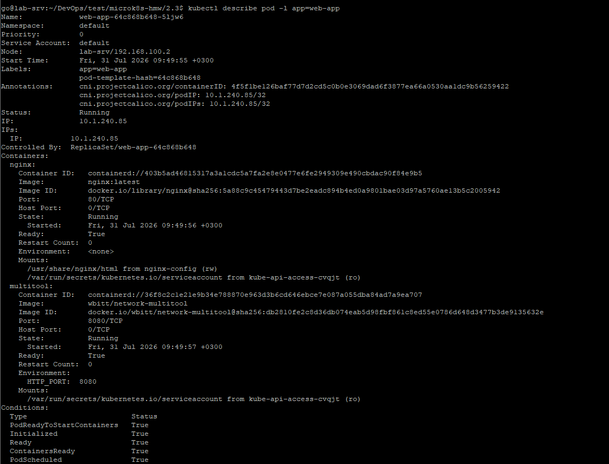
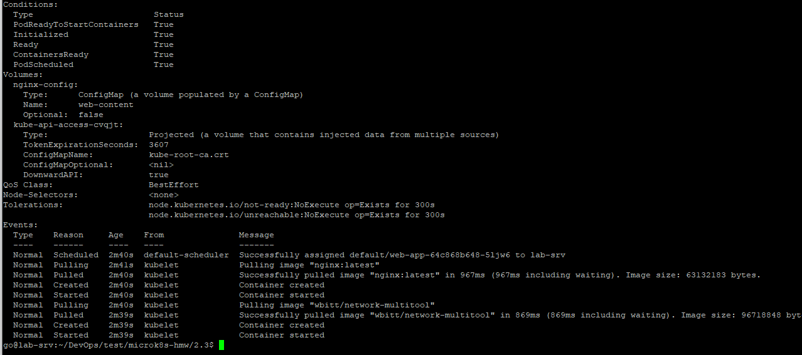

### Шаг 3. Проверить доступность страницы

Быстрый способ — через `port-forward`:
```bash
kubectl port-forward deployment/web-app 8081:80
curl http://localhost:8081/
```

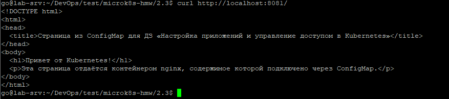

---

## Задание 2. HTTPS с Secret

Файлы: [`secret-tls.yaml`](./secret-tls.yaml) (шаблон, см. пояснение ниже), [`ingress-tls.yaml`](./ingress-tls.yaml), дополнительно [`service-web-app.yaml`](./service-web-app.yaml)

> **`service-web-app.yaml`:** этого файла нет в явном списке манифестов задания, но он необходим технически — Ingress не может маршрутизировать трафик напрямую в под, только через Service. Без него `ingress-tls.yaml` ссылался бы на несуществующий backend.

### Шаг 1. Сгенерировать самоподписанный сертификат

```bash
openssl req -x509 -nodes -days 365 -newkey rsa:2048 \
  -keyout tls.key -out tls.crt -subj "/CN=myapp.example.com"
```

### Шаг 2. Создать Secret

Сгенерировать манифест с секретом командой `kubectl` (она сама корректно закодирует сертификат в base64):
```bash
kubectl create secret tls tls-secret \
  --cert=tls.crt --key=tls.key \
  --dry-run=client -o yaml > secret-tls.yaml

kubectl apply -f secret-tls.yaml
kubectl get secret tls-secret
```
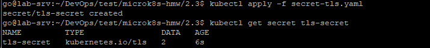

> ⚠️ Файл `secret-tls.yaml` в репозитории — это **шаблон с плейсхолдерами**, а не реальный сертификат. Перед применением обязательно перегенерируйте его командой выше со своим `tls.crt`/`tls.key`.

### Шаг 3. Включить Ingress-контроллер (если ещё не включён) и применить Service + Ingress

```bash
# Включить Ingress в MicroK8s
microk8s enable ingress
# Проверить, что всё поднялось 
kubectl get pods -n ingress
kubectl get ingressclasses
# Применить Service + Ingress
kubectl apply -f service-web-app.yaml
kubectl apply -f ingress-tls.yaml
kubectl get ingress web-app-ingress-tls
```
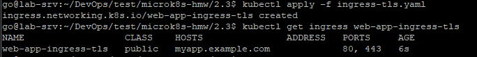

### Шаг 4. Проверить HTTPS-доступ

Так как сертификат выпущен на `CN=myapp.example.com`, а не на реальный IP, для корректной проверки нужно явно сопоставить это имя с IP ноды через `--resolve` (принудительно сопоставляет хост и порт с конкретным IP‑адресом, минуя обычный DNS; `Формат: --resolve <host:port:address>`):
```bash
curl -k --resolve myapp.example.com:443:xxx.xxx.xxx.xxx https://myapp.example.com/
```
(замените `xxx.xxx.xxx.xxx` на реальный IP вашей ноды). Флаг `-k` отключает проверку доверия к самоподписанному сертификату.

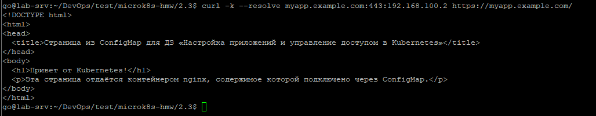

Дополнительно можно посмотреть сам сертификат, отданный сервером:
```bash
curl -kv --resolve myapp.example.com:443:192.168.100.2 https://myapp.example.com/ 2>&1 | grep -i "subject\|issuer"
```

---

## Задание 3. RBAC

Файлы: [`role-pod-reader.yaml`](./role-pod-reader.yaml), [`rolebinding-developer.yaml`](./rolebinding-developer.yaml)

### О найденной и исправленной ошибке

В шаблоне задания в списке `verbs` для Role присутствует `describe` — **это не валидный RBAC-verb**. Допустимые verbs в Kubernetes RBAC: `get`, `list`, `watch`, `create`, `update`, `patch`, `delete`, `deletecollection` (и несколько специальных вроде `use`, `bind`). `describe` — это команда клиента `kubectl`, а не действие API-сервера: под капотом `kubectl describe pod` реально выполняет `get` конкретного пода **плюс** `list` событий (Events), связанных с этим подом, в том же namespace. Поэтому в `role-pod-reader.yaml` вместо несуществующего verb `describe` добавлено отдельное правило на ресурс `events` — без него базовая информация о поде в `describe` всё равно покажется, но раздел `Events` будет пустым/недоступным.

### Шаг 1. Включить RBAC

```bash
microk8s enable rbac
```
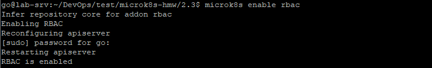

### Шаг 2. Сгенерировать сертификат для пользователя developer

```bash
openssl genrsa -out developer.key 2048
openssl req -new -key developer.key -out developer.csr -subj "/CN=developer"
```

Путь к CA-сертификату/ключу кластера в MicroK8S обычно:
```bash
sudo ls /var/snap/microk8s/current/certs/ca.crt /var/snap/microk8s/current/certs/ca.key
```
(если путь у вас отличается — найдите его через `microk8s inspect` или `find /var/snap/microk8s -name "ca.crt"`).

```bash
sudo openssl x509 -req -in developer.csr \
  -CA /var/snap/microk8s/current/certs/ca.crt \
  -CAkey /var/snap/microk8s/current/certs/ca.key \
  -CAcreateserial -out developer.crt -days 365
```
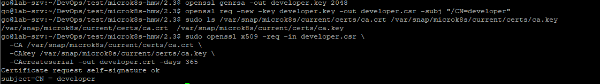

### Шаг 3. Создать Role и RoleBinding

```bash
kubectl apply -f role-pod-reader.yaml
kubectl apply -f rolebinding-developer.yaml
kubectl get role pod-viewer
kubectl get rolebinding developer-pod-viewer-binding
```
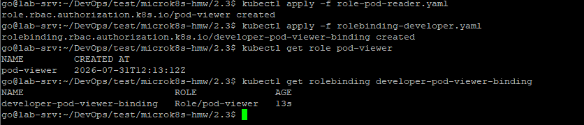

### Шаг 4. Проверить права

Быстрый способ проверки — через флаг `--as` (использует те же правила авторизации API-сервера, не требует настройки отдельного kubeconfig-контекста; для этого у текущего пользователя должно быть право `impersonate`, что по умолчанию есть у admin-доступа MicroK8S):

```bash
# Разрешено: просмотр подов
kubectl get pods --as=developer

# Разрешено: просмотр логов
kubectl logs <имя-любого-пода> --as=developer

# Разрешено: describe (покажет и Events благодаря добавленному правилу)
kubectl describe pod <имя-любого-пода> --as=developer
```
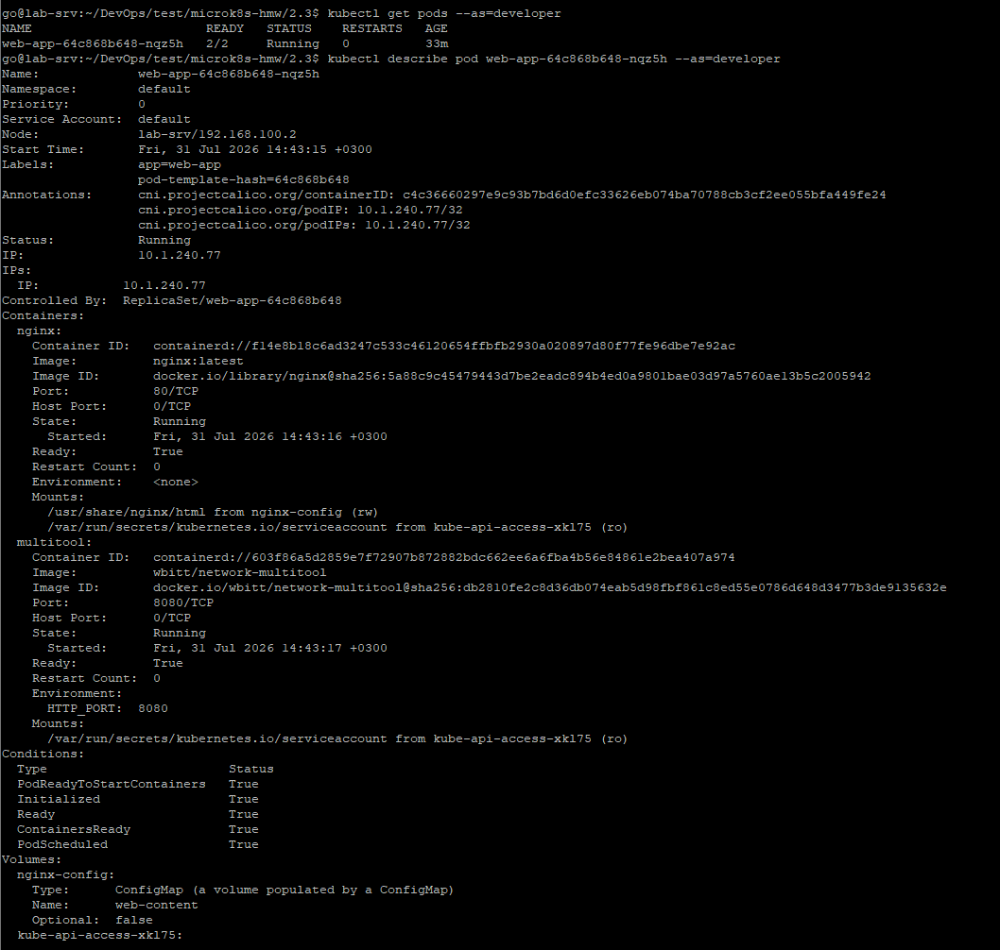
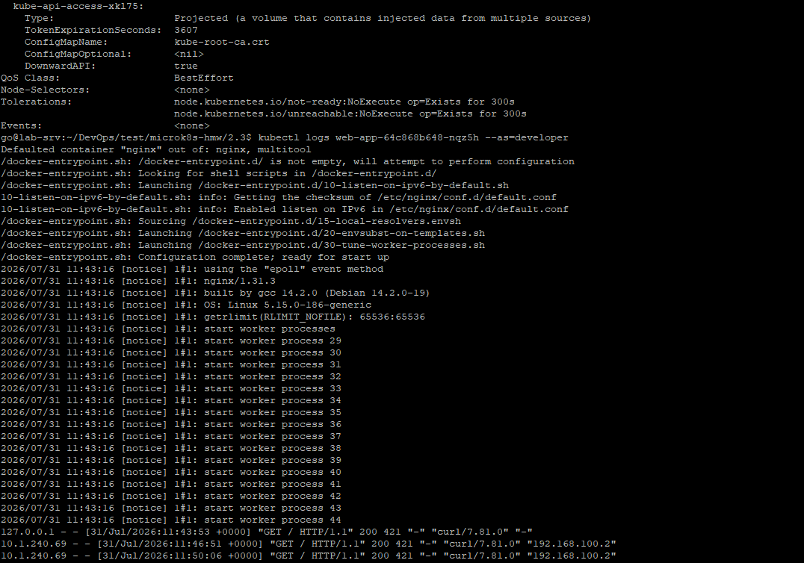

Дмонстрация того, что права **ограничены**:
```bash
# Запрещено: удаление подов (нет verb "delete" в Role)
kubectl delete pod <имя-любого-пода> --as=developer

# Запрещено: доступ за пределами namespace default (Role привязана только к default)
kubectl get pods -n kube-system --as=developer
```

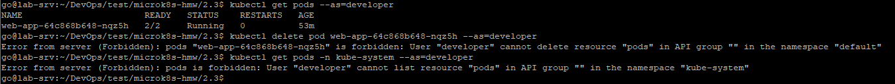

---

## Манифесты

<details>
<summary><code>configmap-web.yaml</code></summary>

```yaml
apiVersion: v1
kind: ConfigMap
metadata:
  name: web-content
  namespace: default
data:
  index.html: |
    <!DOCTYPE html>
    <html>
    <head>
      <title>Страница из ConfigMap для ДЗ «Настройка приложений и управление доступом в Kubernetes»</title>
    </head>
    <body>
      <h1>Привет от Kubernetes!</h1>
      <p>Эта страница отдаётся контейнером nginx, содержимое которой подключено через ConfigMap.</p>
    </body>
    </html>
```
</details>

<details>
<summary><code>deployment.yaml</code></summary>

```yaml
apiVersion: apps/v1
kind: Deployment
metadata:
  name: web-app
spec:
  replicas: 1
  selector:
    matchLabels:
      app: web-app
  template:
    metadata:
      labels:
        app: web-app
    spec:
      containers:
        - name: nginx
          image: nginx:latest
          ports:
            - containerPort: 80
          volumeMounts:
            - name: nginx-config
              mountPath: /usr/share/nginx/html

        - name: multitool
          image: wbitt/network-multitool
          ports:
            - containerPort: 8080
          env:
            - name: HTTP_PORT
              value: "8080"

      volumes:
        - name: nginx-config
          configMap:
            name: web-content
```
</details>

<details>
<summary><code>service-web-app.yaml</code></summary>

```yaml
apiVersion: v1
kind: Service
metadata:
  name: web-app-service
spec:
  type: ClusterIP
  selector:
    app: web-app
  ports:
    - port: 80
      targetPort: 80
```
</details>

<details>
<summary><code>secret-tls.yaml</code> (шаблон — перегенерировать перед применением)</summary>

```yaml
apiVersion: v1
kind: Secret
metadata:
  name: tls-secret
type: kubernetes.io/tls
data:
  tls.crt: <base64-содержимое tls.crt>
  tls.key: <base64-содержимое tls.key>
```
</details>

<details>
<summary><code>ingress-tls.yaml</code></summary>

```yaml
apiVersion: networking.k8s.io/v1
kind: Ingress
metadata:
  name: web-app-ingress-tls
spec:
  ingressClassName: public
  tls:
    - hosts:
        - myapp.example.com
      secretName: tls-secret
  rules:
    - host: myapp.example.com
      http:
        paths:
          - path: /
            pathType: Prefix
            backend:
              service:
                name: web-app-service
                port:
                  number: 80
```
</details>

<details>
<summary><code>role-pod-reader.yaml</code></summary>

```yaml
apiVersion: rbac.authorization.k8s.io/v1
kind: Role
metadata:
  name: pod-viewer
  namespace: default
rules:
  - apiGroups: [""]
    resources:
      - pods
      - pods/log
    verbs:
      - get
      - list
      - watch

  - apiGroups: [""]
    resources:
      - events
    verbs:
      - get
      - list
      - watch
```
</details>

<details>
<summary><code>rolebinding-developer.yaml</code></summary>

```yaml
apiVersion: rbac.authorization.k8s.io/v1
kind: RoleBinding
metadata:
  name: developer-pod-viewer-binding
  namespace: default
subjects:
  - kind: User
    name: developer
    apiGroup: rbac.authorization.k8s.io
roleRef:
  kind: Role
  name: pod-viewer
  apiGroup: rbac.authorization.k8s.io
```
</details>

---

## Очистка ресурсов

```bash
kubectl delete -f rolebinding-developer.yaml
kubectl delete -f role-pod-reader.yaml
kubectl delete -f ingress-tls.yaml
kubectl delete -f secret-tls.yaml
kubectl delete -f service-web-app.yaml
kubectl delete -f deployment.yaml
kubectl delete -f configmap-web.yaml
```
