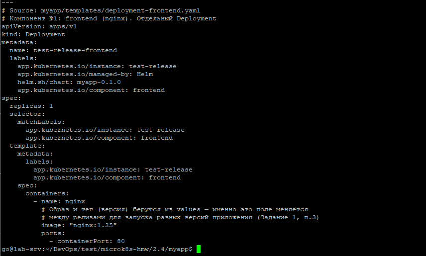
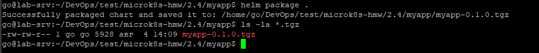
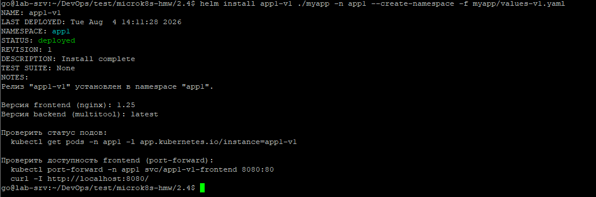
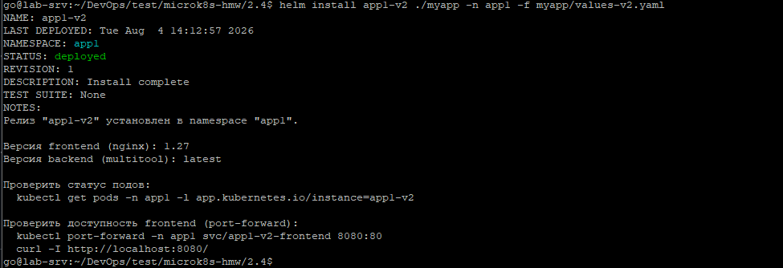
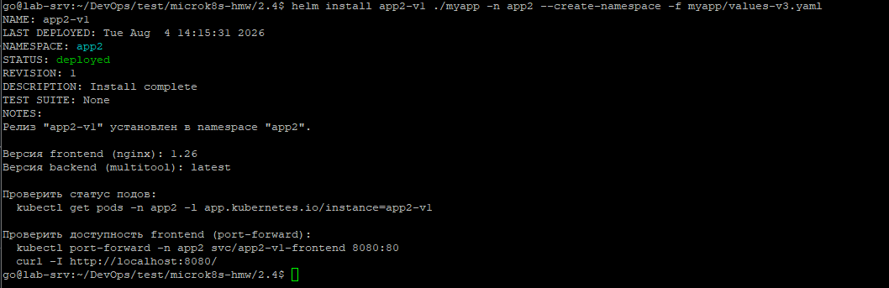
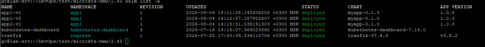
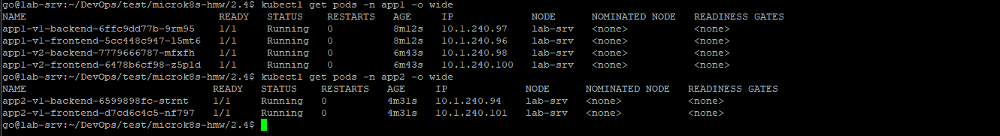
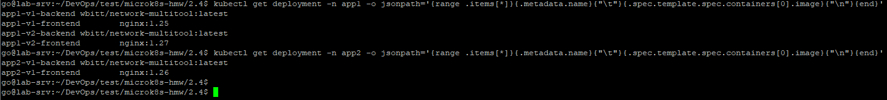
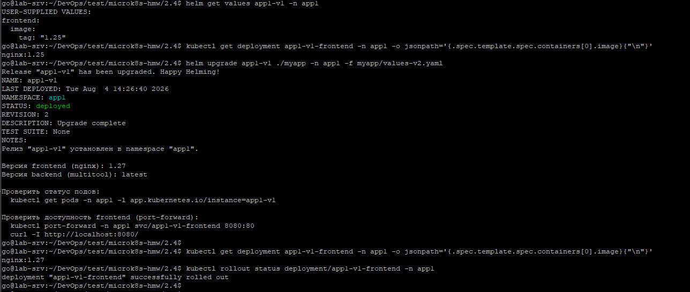
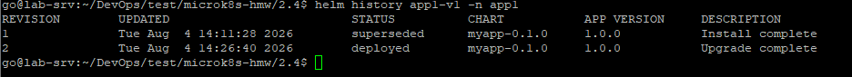

# Домашнее задание: Helm

Репозиторий содержит Helm-чарт [`myapp/`](./myapp), упаковывающий учебное приложение из двух компонентов (каждый — отдельный `Deployment` + `Service`):
- **frontend** (`nginx`) — версия образа управляется через `values.frontend.image.tag`.
- **backend** (`multitool`) — вспомогательный компонент для проверки сетевой связности.

---

## Предварительные требования

```bash
kubectl get nodes
helm version
```

---

## Задание 1. Подготовить Helm-чарт

Структура чарта:
```
myapp/
├── Chart.yaml              # метаданные чарта: имя, версия чарта, версия приложения
├── values.yaml              # значения по умолчанию для ВСЕХ параметров шаблонов
├── values-v1.yaml            # частичный оверрайд: только tag = "1.25"
├── values-v2.yaml            # частичный оверрайд: только tag = "1.27"
├── values-v3.yaml            # частичный оверрайд: только tag = "1.26"
└── templates/
    ├── _helpers.tpl           # переиспользуемые именованные шаблоны (имена, лейблы)
    ├── deployment-frontend.yaml
    ├── deployment-backend.yaml
    ├── service-frontend.yaml
    ├── service-backend.yaml
    └── NOTES.txt               # подсказка, которую helm печатает после install/upgrade
```

Каждый компонент приложения (`frontend`, `backend`) — отдельный `Deployment` со своим `Service`, как того требует задание. Версия приложения (тег образа `nginx`) — параметризована через `values.frontend.image.tag` (Задание 1, п.3).


### Шаг 1. Проверить чарт линтером

```bash
cd myapp
helm lint .
```


### Шаг 2. Отрендерить шаблоны локально (без установки в кластер)

Проверка итоговых манифестов перед реальным `install`:
```bash
helm template test-release . -f values-v1.yaml
```


### Шаг 3. Упаковать чарт

```bash
helm package .
ls -la *.tgz
```


---

## Задание 2. Запустить несколько версий в разных неймспейсах

Разворачиваем **три релиза** одного и того же чарта с разными версиями `frontend`:
1. `app1-v1` — namespace `app1`, версия `1.25`
2. `app1-v2` — namespace `app1` (тот же), версия `1.27`
3. `app2-v1` — namespace `app2`, версия `1.26`

### Шаг 1. Первый релиз — namespace app1, версия 1

```bash
helm install app1-v1 ./myapp -n app1 --create-namespace -f myapp/values-v1.yaml
```


### Шаг 2. Второй релиз — тот же namespace app1, версия 2

```bash
helm install app1-v2 ./myapp -n app1 -f myapp/values-v2.yaml
```
**namespace не пересоздаётся** - имена ресурсов не конфликтуют благодаря тому, что в шаблонах используется `{{ .Release.Name }}` — у каждого релиза свой уникальный префикс (`app1-v1-frontend`, `app1-v2-frontend` и т.д.).



### Шаг 3. Третий релиз — namespace app2, версия 3

```bash
helm install app2-v1 ./myapp -n app2 --create-namespace -f myapp/values-v3.yaml
```



### Шаг 4. Продемонстрировать результат

Список всех релизов Helm по всем неймспейсам:
```bash
helm list -A
```




Поды по неймспейсам:
```bash
kubectl get pods -n app1 -o wide
kubectl get pods -n app2 -o wide
```



Проверка реальной версии образа в каждом релизе:
```bash
kubectl get deployment -n app1 -o jsonpath='{range .items[*]}{.metadata.name}{"\t"}{.spec.template.spec.containers[0].image}{"\n"}{end}'
kubectl get deployment -n app2 -o jsonpath='{range .items[*]}{.metadata.name}{"\t"}{.spec.template.spec.containers[0].image}{"\n"}{end}'
```



Проверка через `curl` (у каждого релиза свой Service, порт можно прокинуть локально):
```bash
kubectl port-forward -n app1 svc/app1-v1-frontend 8081:80 &
kubectl port-forward -n app1 svc/app1-v2-frontend 8082:80 &
kubectl port-forward -n app2 svc/app2-v1-frontend 8083:80 &

curl -sI http://localhost:8081/ | grep -i server
curl -sI http://localhost:8082/ | grep -i server
curl -sI http://localhost:8083/ | grep -i server
```


---

## Обновление релиза через helm upgrade

**Обновление** приложений с помощью Helm — демонстрация на релизе `app1-v1`.


```bash
# До обновления
# Просмотр параметров (значения переменных), которые были переданы при установке
helm get values app1-v1 -n app1
# Вывод текущего Docker-образа и его тег (версию), который используется в  Deployment'е
kubectl get deployment app1-v1-frontend -n app1 -o jsonpath='{.spec.template.spec.containers[0].image}{"\n"}'

# Обновление
helm upgrade app1-v1 ./myapp -n app1 -f myapp/values-v2.yaml

# После обновления, проверка версии 
kubectl get deployment app1-v1-frontend -n app1 -o jsonpath='{.spec.template.spec.containers[0].image}{"\n"}'

# Вывод состояние развертывания
kubectl rollout status deployment/app1-v1-frontend -n app1
```



История релиза и откат:
```bash
helm history app1-v1 -n app1
# При необходимости откатиться:
# helm rollback app1-v1 1 -n app1
```



---

## Манифесты чарта


<details>
<summary><code>Chart.yaml</code></summary>

```yaml
apiVersion: v2
name: myapp
description: >-
  Учебный Helm-чарт для ДЗ по Helm. Приложение состоит из двух компонентов
  (каждый — отдельный Deployment): frontend (nginx) и backend (multitool).
  Версия frontend-образа управляется через values (image.tag), что позволяет
  запускать несколько версий приложения одновременно в разных релизах/неймспейсах.
type: application
version: 0.1.0        # Версия САМОГО ЧАРТА (структуры манифестов)
appVersion: "1.0.0"   # Версия ПРИЛОЖЕНИЯ по умолчанию (справочно, реальная версия — из values.frontend.image.tag)

```
</details>

<details>
<summary><code>values.yaml</code></summary>

```yaml
# Значения по умолчанию для чарта myapp.
# Переопределяются через -f values-*.yaml или --set при helm install/upgrade.

frontend:
  replicaCount: 1
  image:
    repository: nginx
    tag: "1.25"          # КЛЮЧЕВОЕ ЗНАЧЕНИЕ: именно эта переменная меняется между версиями (Задание 1, п.3)
  service:
    port: 80
    targetPort: 80

backend:
  replicaCount: 1
  image:
    repository: wbitt/network-multitool
    tag: "latest"
  httpPort: 8080          # Порт, на котором multitool поднимает свой веб-сервер (через env HTTP_PORT)
  service:
    port: 9002
    targetPort: 8080

```
</details>

<details>
<summary><code>values-v1.yaml</code> / <code>values-v2.yaml</code> / <code>values-v3.yaml</code></summary>

```yaml
# values-v1.yaml
frontend:
  image:
    tag: "1.25"
```
```yaml
# values-v2.yaml
frontend:
  image:
    tag: "1.27"
```
```yaml
# values-v3.yaml
frontend:
  image:
    tag: "1.26"
```
</details>

<details>
<summary><code>templates/_helpers.tpl</code></summary>

```yaml
{{/*
Базовое имя ресурсов — берём имя релиза (уникально для каждой установки чарта:
helm install app1-v1 ..., helm install app1-v2 ..., helm install app2-v1 ...).
Благодаря этому несколько релизов чарта не конфликтуют по именам ресурсов
даже в одном namespace (Задание 2).
*/}}
{{- define "myapp.fullname" -}}
{{- .Release.Name | trunc 63 | trimSuffix "-" -}}
{{- end -}}

{{/*
Общие лейблы.
Используются на всех ресурсах чарта.
*/}}
{{- define "myapp.labels" -}}
app.kubernetes.io/instance: {{ .Release.Name }}
app.kubernetes.io/managed-by: {{ .Release.Service }}
helm.sh/chart: {{ .Chart.Name }}-{{ .Chart.Version }}
{{- end -}}

```
</details>

<details>
<summary><code>templates/deployment-frontend.yaml</code></summary>

```yaml
# Компонент №2: backend (multitool). Отдельный Deployment.
apiVersion: apps/v1
kind: Deployment
metadata:
  name: {{ include "myapp.fullname" . }}-backend
  labels:
    {{- include "myapp.labels" . | nindent 4 }}
    app.kubernetes.io/component: backend
spec:
  replicas: {{ .Values.backend.replicaCount }}
  selector:
    matchLabels:
      app.kubernetes.io/instance: {{ .Release.Name }}
      app.kubernetes.io/component: backend
  template:
    metadata:
      labels:
        app.kubernetes.io/instance: {{ .Release.Name }}
        app.kubernetes.io/component: backend
    spec:
      containers:
        - name: multitool
          image: "{{ .Values.backend.image.repository }}:{{ .Values.backend.image.tag }}"
          ports:
            - containerPort: {{ .Values.backend.httpPort }}
          env:
            # HTTP_PORT обязателен для multitool, иначе он поднимет свой веб-сервер
            # на порту 80 и, если бы был в одном поде с nginx, конфликтовал бы с ним.
            # Здесь компоненты в разных подах, но переменную
            # оставляем явной для ясности, на случай будущего изменения архитектуры.
            - name: HTTP_PORT
              value: "{{ .Values.backend.httpPort }}"

```
</details>

<details>
<summary><code>templates/deployment-backend.yaml</code></summary>

```yaml
# Компонент №2: backend (multitool). Отдельный Deployment.
apiVersion: apps/v1
kind: Deployment
metadata:
  name: {{ include "myapp.fullname" . }}-backend
  labels:
    {{- include "myapp.labels" . | nindent 4 }}
    app.kubernetes.io/component: backend
spec:
  replicas: {{ .Values.backend.replicaCount }}
  selector:
    matchLabels:
      app.kubernetes.io/instance: {{ .Release.Name }}
      app.kubernetes.io/component: backend
  template:
    metadata:
      labels:
        app.kubernetes.io/instance: {{ .Release.Name }}
        app.kubernetes.io/component: backend
    spec:
      containers:
        - name: multitool
          image: "{{ .Values.backend.image.repository }}:{{ .Values.backend.image.tag }}"
          ports:
            - containerPort: {{ .Values.backend.httpPort }}
          env:
            # HTTP_PORT обязателен для multitool, иначе он поднимет свой веб-сервер
            # на порту 80 и, если бы был в одном поде с nginx, конфликтовал бы с ним.
            # Здесь компоненты в разных подах, но переменную
            # оставляем явной для ясности, на случай будущего изменения архитектуры.
            - name: HTTP_PORT
              value: "{{ .Values.backend.httpPort }}"

```
</details>

<details>
<summary><code>templates/service-frontend.yaml</code></summary>

```yaml
# Service для компонента frontend (nginx).
# Отдельный Service на каждый компонент — так же, как и Deployment,
# чтобы к frontend и backend можно было обращаться независимо друг от друга
# по собственному стабильному DNS-имени внутри кластера.
apiVersion: v1
kind: Service
metadata:
  name: {{ include "myapp.fullname" . }}-frontend
  labels:
    {{- include "myapp.labels" . | nindent 4 }}
    app.kubernetes.io/component: frontend
spec:
  type: ClusterIP                                    # Доступ только внутри кластера (наружу — через port-forward/Ingress)
  selector:
    # ВАЖНО: селектор должен ТОЧНО совпадать с лейблами пода в deployment-frontend.yaml
    # (app.kubernetes.io/instance + app.kubernetes.io/component), иначе Service
    # не найдёт под и Endpoints останутся пустыми.
    app.kubernetes.io/instance: {{ .Release.Name }}
    app.kubernetes.io/component: frontend
  ports:
    - port: {{ .Values.frontend.service.port }}         # Порт, на котором Service доступен внутри кластера
      targetPort: {{ .Values.frontend.service.targetPort }}  # Порт контейнера nginx, куда реально идёт трафик

```
</details>

<details>
<summary><code>templates/service-backend.yaml</code></summary>

```yaml
# Service для компонента backend (multitool).
# Через этот Service, например, frontend или другие поды кластера могли бы
# обращаться к multitool по имени backend-service, не зная его реального Pod IP
# (Pod IP меняется при каждом пересоздании пода, ClusterIP Service — стабилен).
apiVersion: v1
kind: Service
metadata:
  name: {{ include "myapp.fullname" . }}-backend
  labels:
    {{- include "myapp.labels" . | nindent 4 }}
    app.kubernetes.io/component: backend
spec:
  type: ClusterIP                                   # Доступ только внутри кластера
  selector:
    # Должен совпадать с лейблами пода в deployment-backend.yaml
    app.kubernetes.io/instance: {{ .Release.Name }}
    app.kubernetes.io/component: backend
  ports:
    - port: {{ .Values.backend.service.port }}         # Порт, на котором Service доступен внутри кластера
      targetPort: {{ .Values.backend.service.targetPort }}  # Порт контейнера multitool (HTTP_PORT из deployment-backend.yaml)

```
</details>


---

## Очистка ресурсов

```bash
helm uninstall app1-v1 -n app1
helm uninstall app1-v2 -n app1
helm uninstall app2-v1 -n app2

kubectl delete namespace app1
kubectl delete namespace app2
```
